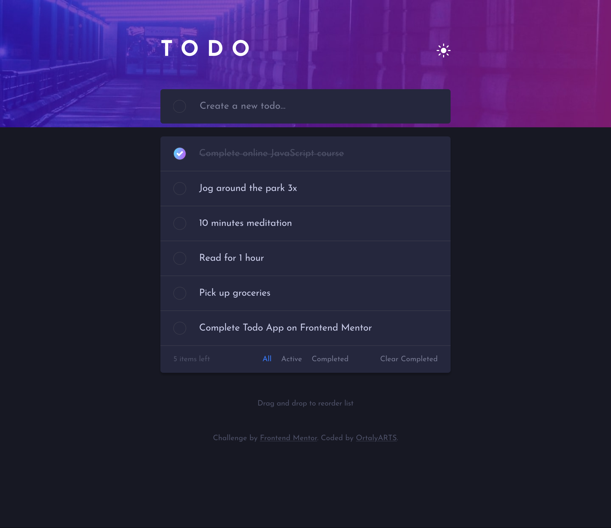

# Frontend Mentor - Todo app solution

This is a solution to the [Todo app challenge on Frontend Mentor](https://www.frontendmentor.io/challenges/todo-app-Su1_KokOW). Frontend Mentor challenges help you improve your coding skills by building realistic projects. 

## Table of contents

- [Overview](#overview)
  - [The challenge](#the-challenge)
  - [Screenshot](#screenshot)
  - [Links](#links)
- [My process](#my-process)
  - [Built with](#built-with)
  - [Useful resources](#useful-resources)
- [Author](#author)
- [Acknowledgments](#acknowledgments)

## Overview

### The challenge

Users should be able to:

- View the optimal layout for the app depending on their device's screen size
- See hover states for all interactive elements on the page
- Add new todos to the list
- Mark todos as complete
- Delete todos from the list
- Filter by all/active/complete todos
- Clear all completed todos
- Toggle light and dark mode
- **Bonus**: Drag and drop to reorder items on the list

### Screenshot

### Links

- Solution URL: [View Code](https://github.com/ortalyarts/frontendmentor-todo-app)
- Live Site URL: [Preview Site](https://frontendmentor-todo-app-chi.vercel.app/)

## My process

### Built with

- Semantic HTML5 markup
- Native CSS
- Vanilla JavaScript ES6
- Mobile-first workflow
- [React](https://reactjs.org/) - JS library
- [react-toggle](https://github.com/aaronshaf/react-toggle) - toggle button
- [react-responsive](https://github.com/yocontra/react-responsive) - lets get the result of a CSS media query and have the value automatically update whenever the query result changes. 
- [dnd-kit](https://docs.dndkit.com/) - drag & drop toolkit for React

### Useful resources

- [Dark mode in React](https://medium.com/@nathanielnw/adding-dark-mode-to-your-react-app-with-hooks-media-queries-and-css-variables-6694acfed4b4) - Adding dark mode to your React app with hooks, media queries and CSS variables
- [CSS gradient generator](https://cssgradient.io/)
- [crypto.randomUUID()](https://www.uuidgenerator.net/dev-corner/javascript) - Generate rundom UUID
- [Deactivate dnd-kit Sensors for child buttons/checkboxes etc.](https://github.com/clauderic/dnd-kit/issues/477)

## Author

- OrtalyARTS Portfolio Website - [@ortalyARTS.com](https://ortaly.com/)
- Frontend Mentor - [@ortalyARTS](https://www.frontendmentor.io/profile/ortalyARTS)
- Linkedin - [@ortalyARTS](www.linkedin.com/in/ortalyarts) 

## Acknowledgments

[Bro Code](www.youtube.com/@BroCodez) - React tutorials

